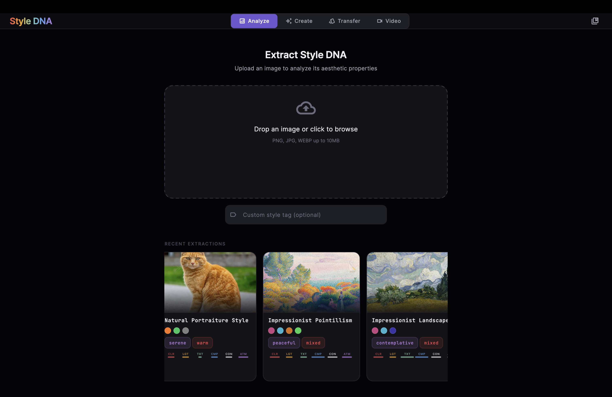
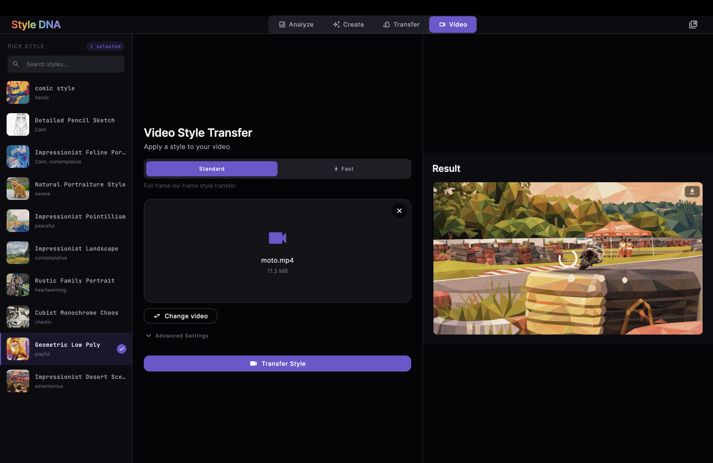
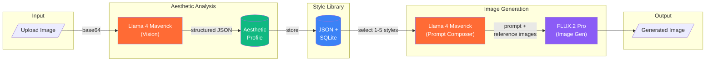
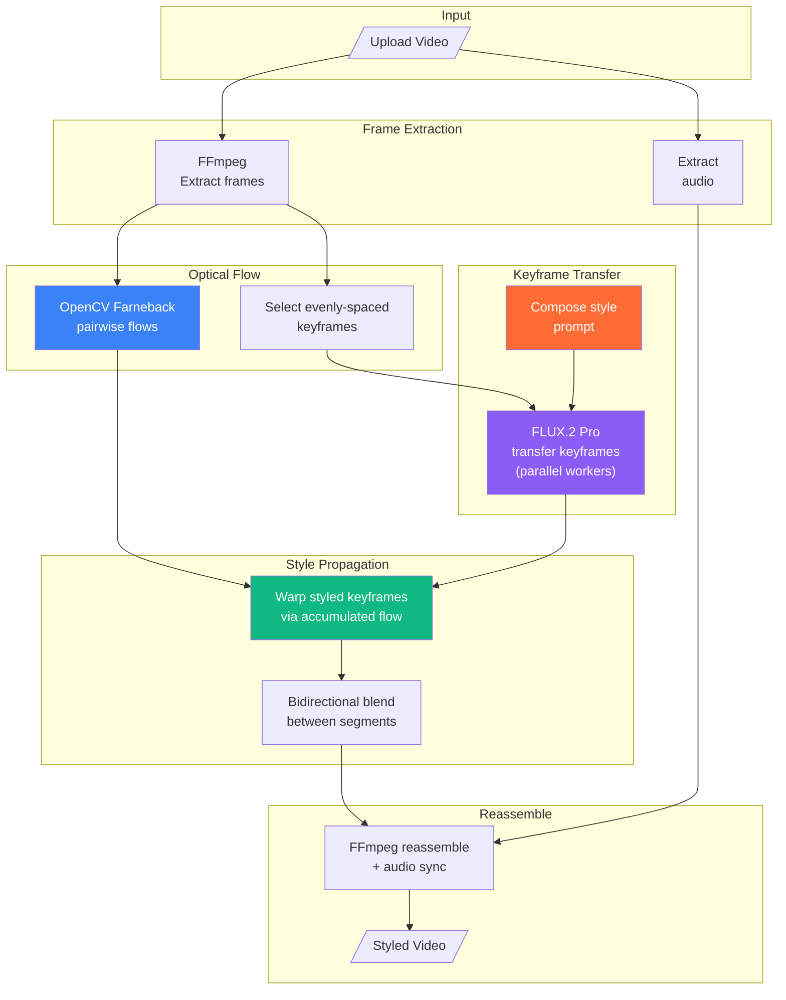

<div align="center">

# Style DNA

**Extract the visual DNA from any image. Generate new images -- or transfer styles to video -- that match that aesthetic.**

[](https://python.org)
[](https://fastapi.tiangolo.com)
[](https://flutter.dev)
[](https://together.ai)
[](LICENSE)
[](#getting-started)

</div>

---

<!--
=======================================================================
SCREENSHOT CAPTURE GUIDE
=======================================================================
To add visuals, capture the following and save to docs/screenshots/:

1. analyze.png   - The analyze screen with a completed DNA extraction
                   showing the StyleDnaCard with color palette and gauges
2. generate.png  - A generated image result with the prompt visible
3. library.png   - The style library drawer with 3-4 style cards
4. video.png     - The video transfer progress view or before/after

For a hero GIF (docs/demo.gif):
  Record a 15-20s flow: drop image → DNA helix loader → profile card →
  switch to generate → select style → generate image

Then uncomment the screenshot section below.
=======================================================================
-->

<!--
<div align="center">
<table>
<tr>
<td align="center"><br><b>Style DNA Extraction</b></td>
<td align="center"><br><b>Styled Image Generation</b></td>
</tr>
<tr>
<td align="center"><br><b>Style Library</b></td>
<td align="center"><br><b>Video Style Transfer</b></td>
</tr>
</table>
</div>
-->

## Table of Contents

- [How It Works](#how-it-works)
- [The Aesthetic Profile](#the-aesthetic-profile)
- [Architecture](#architecture)
- [Getting Started](#getting-started)
- [API Reference](#api-reference)
- [Frontend](#frontend)
- [Project Structure](#project-structure)
- [Tech Stack](#tech-stack)
- [Contributing](#contributing)
- [License](#license)

## How It Works

**1. Analyze** -- Upload any image. Llama 4 Maverick vision extracts a structured aesthetic profile covering six dimensions: color grading, lighting, texture, composition, contrast, and atmosphere.

**2. Store** -- Each profile is saved to your Style Library with a unique ID, source image reference, and auto-generated style tag.

**3. Generate** -- Select one or more styles from your library. The system composes a detailed prompt from the combined aesthetics, then FLUX.2 Pro generates a new image. Optionally provide a scene description or reference image.

**4. Transfer (Image)** -- Apply any saved style to a new image. The source content is preserved while the aesthetic is fully transformed.

**5. Transfer (Video)** -- Two modes:
   - **Standard** -- Transfers style to sampled frames, interpolates the gaps, applies temporal smoothing
   - **Fast (Optical Flow)** -- Transfers only a few keyframes via FLUX.2 Pro, then propagates the style to all frames using OpenCV Farneback optical flow. **3-5x faster** with smoother temporal coherence.

## The Aesthetic Profile

Every image is decomposed into six aesthetic dimensions:

| Dimension | What It Captures | Example Values |
|-----------|-----------------|----------------|
| **Color Grading** | Dominant colors (hex), palette type, temperature, saturation | `#FFFF00, #0097A7` / warm / vivid |
| **Lighting** | Direction, quality, contrast ratio, mood | frontal / diffused / high / energetic |
| **Texture** | Grain, surface quality, sharpness | none / smooth / sharp |
| **Composition** | Technique, depth layers, framing | dynamic posing / shallow / close-up |
| **Contrast** | Dynamic range, shadow depth, highlight character | compressed / lifted / clipped |
| **Atmosphere** | Mood, emotional tone, genre | heroic / confident / superhero |

<details>
<summary><b>Full Example: "Comic Book Hero" Profile (JSON)</b></summary>

```json
{
  "style_tag": "Comic Book Hero",
  "color_grading": {
    "dominant_colors": ["#FFFF00", "#0097A7", "#FF0000", "#000000"],
    "palette_type": "mixed",
    "color_temperature": "warm",
    "saturation": "vivid"
  },
  "lighting": {
    "direction": "frontal",
    "quality": "diffused",
    "contrast_ratio": "high",
    "mood": "energetic"
  },
  "texture": {
    "grain": "none",
    "surface_quality": "smooth digital illustration with clean lines",
    "sharpness": "sharp"
  },
  "composition": {
    "technique": "dynamic posing with exaggerated proportions",
    "depth_layers": "shallow",
    "framing": "close-up hero shot"
  },
  "contrast": {
    "dynamic_range": "compressed",
    "shadow_depth": "lifted",
    "highlight_character": "clipped with bold highlights"
  },
  "atmosphere": {
    "mood": "heroic and action-packed",
    "emotional_tone": "confident and powerful",
    "genre": "superhero comic book"
  }
}
```

</details>

## Architecture

### Image Analysis & Generation Pipeline



### Fast Video Transfer (Optical Flow)



## Getting Started

### Prerequisites

- Python 3.12+
- [Together AI API key](https://api.together.xyz/) (free tier available)
- FFmpeg (for video transfer features)
- Flutter 3.10+ (for the frontend, optional)

### Docker (Recommended)

```bash
git clone https://github.com/soulfir/style-dna.git
cd style-dna/aesthetic-style-builder
cp .env.example .env
# Edit .env and add your Together API key
docker compose up --build
```

The API will be available at `http://localhost:8080`.

### Manual Setup

```bash
git clone https://github.com/soulfir/style-dna.git
cd style-dna/aesthetic-style-builder
python -m venv venv
source venv/bin/activate
pip install -r requirements.txt
cp .env.example .env
# Edit .env and add your Together API key
uvicorn main:app --reload
```

The API will be available at `http://localhost:8000`.

### Environment Variables

| Variable | Required | Default | Description |
|----------|----------|---------|-------------|
| `TOGETHER_API_KEY` | Yes | -- | Your [Together AI](https://api.together.xyz/) API key |
| `VISION_MODEL` | No | `meta-llama/Llama-4-Maverick-17B-128E-Instruct-FP8` | Vision model for analysis |
| `CHAT_MODEL` | No | `meta-llama/Llama-4-Maverick-17B-128E-Instruct-FP8` | Chat model for prompt composition |
| `IMAGE_MODEL` | No | `black-forest-labs/FLUX.2-pro` | Image generation model |
| `MAX_VIDEO_DURATION` | No | `60` | Max video duration in seconds |

> [!NOTE]
> The free Together AI tier includes sufficient credits to experiment with analysis and generation. Video transfer uses more credits due to multiple FLUX.2 Pro calls per keyframe.

## API Reference

| Method | Endpoint | Description |
|--------|----------|-------------|
| `POST` | `/analyze` | Extract aesthetic profile from an image |
| `POST` | `/create` | Generate image from 1-5 style profiles |
| `POST` | `/transfer` | Transfer a style to a single image |
| `POST` | `/transfer/video` | Video style transfer (frame-by-frame) |
| `POST` | `/transfer/video/fast` | Fast video transfer (optical flow) |
| `GET` | `/transfer/video/jobs` | List all video transfer jobs |
| `GET` | `/transfer/video/{job_id}` | Get video job status |
| `GET` | `/styles` | List saved style profiles |
| `GET` | `/styles/{id}` | Get a specific style profile |
| `DELETE` | `/styles/{id}` | Delete a style profile |

> [!TIP]
> Interactive API docs are available at `/docs` (Swagger UI) when the server is running.

<details>
<summary><b>POST /analyze</b> -- Extract aesthetic DNA from an image</summary>

**Request:** `multipart/form-data`

| Field | Type | Required | Description |
|-------|------|----------|-------------|
| `file` | File | Yes | Image file (max 10MB) |
| `custom_tag` | string | No | Custom name for the style |

**Response:**

```json
{
  "style": {
    "id": "a17ae958",
    "style_tag": "Comic Book Hero",
    "profile": { "color_grading": {}, "lighting": {}, "..." : "..." },
    "source_image_path": "/app/uploads/abc123.jpg",
    "created_at": "2026-03-07T12:56:55"
  },
  "message": "Style 'Comic Book Hero' extracted and saved"
}
```

</details>

<details>
<summary><b>POST /create</b> -- Generate an image from style profiles</summary>

**Request:** `multipart/form-data`

| Field | Type | Required | Description |
|-------|------|----------|-------------|
| `style_ids` | JSON array | Yes | 1-5 style IDs to combine |
| `prompt` | string | No | Scene/subject description |
| `reference_image` | File | No | Composition reference |
| `seed` | int | No | Seed for reproducibility |
| `width` | int | No | 256-2048, multiple of 64 (default 1024) |
| `height` | int | No | 256-2048, multiple of 64 (default 1024) |

**Response:**

```json
{
  "image_url": "/output/generated_20260307_125930.png",
  "prompt_used": "A cinematic scene with warm golden...",
  "message": "Image generated successfully"
}
```

</details>

<details>
<summary><b>POST /transfer</b> -- Transfer style to a single image</summary>

**Request:** `multipart/form-data`

| Field | Type | Required | Description |
|-------|------|----------|-------------|
| `image` | File | Yes | Image to restyle (max 10MB) |
| `style_id` | string | Yes | Style to apply |
| `seed` | int | No | Seed for reproducibility |
| `width` | int | No | Output width (default 1024) |
| `height` | int | No | Output height (default 1024) |

</details>

<details>
<summary><b>POST /transfer/video/fast</b> -- Fast video transfer with optical flow</summary>

**Request:** `multipart/form-data`

| Field | Type | Required | Description |
|-------|------|----------|-------------|
| `video` | File | Yes | Video file (max 100MB, 60s) |
| `style_id` | string | Yes | Style to apply |
| `num_keyframes` | int | No | Keyframes to transfer (2-20, default 6) |
| `seed` | int | No | Seed for reproducibility |
| `max_workers` | int | No | Parallel workers (1-8, default 4) |

**Response:**

```json
{
  "job_id": "abc123def456",
  "message": "Fast video transfer job started (optical flow mode)",
  "estimated_duration": 45.2,
  "video_info": {
    "duration": 10.5,
    "fps": 30.0,
    "width": 1920,
    "height": 1080,
    "has_audio": true,
    "total_frames": 315
  }
}
```

Poll `GET /transfer/video/{job_id}` for progress updates with estimated time remaining.

</details>

<details>
<summary><b>POST /transfer/video</b> -- Standard video transfer (frame-by-frame)</summary>

**Request:** `multipart/form-data`

| Field | Type | Required | Description |
|-------|------|----------|-------------|
| `video` | File | Yes | Video file (max 100MB, 60s) |
| `style_id` | string | Yes | Style to apply |
| `sample_rate` | int | No | Process every Nth frame (1-30, default 4) |
| `max_frames` | int | No | Max frames to transfer (10-500, default 120) |
| `temporal_smoothing` | bool | No | Apply 5-tap smoothing (default true) |
| `max_workers` | int | No | Parallel workers (1-8, default 4) |

</details>

## Frontend

The Flutter app (`aesthetic_style_dna/`) provides a full desktop/mobile GUI:

- **Drag-and-drop** image upload with animated DNA helix loader
- **Style Library** with visual DNA cards showing color palettes, property gauges, and mood chips
- **Multi-style generation** -- select and combine up to 5 aesthetics
- **Image and video transfer** with real-time progress tracking and video playback
- **Glass morphism UI** with dark theme, animated gradients, and shimmer loading

### Running the Frontend

```bash
cd aesthetic_style_dna
flutter pub get
flutter run -d macos  # or: chrome, ios, android
```

> [!IMPORTANT]
> The frontend connects to `http://localhost:8080` by default (Docker port). If running the backend without Docker, update `lib/config/api_config.dart` to use port `8000`.

## Project Structure

```
style-dna/
├── aesthetic-style-builder/        # FastAPI backend
│   ├── main.py                     # API endpoints (13 routes)
│   ├── analyze.py                  # Llama 4 Maverick vision analysis
│   ├── create.py                   # Prompt composition + FLUX.2 Pro generation
│   ├── workflow.py                 # Agno workflow orchestration
│   ├── models.py                   # Pydantic data models
│   ├── optical_flow.py             # OpenCV Farneback flow computation
│   ├── fast_video_transfer.py      # Keyframe + flow propagation pipeline
│   ├── video_transfer.py           # Frame-by-frame video transfer
│   ├── video_jobs.py               # Background job management
│   ├── utils.py                    # Image encoding, retry logic
│   ├── Dockerfile
│   └── docker-compose.yml
├── aesthetic_style_dna/            # Flutter frontend
│   └── lib/
│       ├── screens/                # Analyze, Create, Transfer, Video
│       ├── widgets/                # DNA cards, glass morphism, loaders
│       ├── providers/              # Riverpod state management
│       ├── models/                 # Dart data models
│       └── services/               # API client (Dio)
├── LICENSE
├── CONTRIBUTING.md
└── README.md
```

## Tech Stack

| Layer | Technology | Purpose |
|-------|-----------|---------|
| **API** | [FastAPI](https://fastapi.tiangolo.com) | Async REST API with auto-generated OpenAPI docs |
| **Vision AI** | [Llama 4 Maverick](https://together.ai) (17B) | Structured aesthetic analysis via Together AI |
| **Image Gen** | [FLUX.2 Pro](https://together.ai) | Image generation with multi-reference support |
| **Orchestration** | [Agno](https://agno.com) | Stateful workflow management with session persistence |
| **Video** | [OpenCV](https://opencv.org) + [FFmpeg](https://ffmpeg.org) | Optical flow computation, frame extraction, video assembly |
| **Data** | [Pydantic](https://docs.pydantic.dev) + SQLite | Typed models, validation, persistent storage |
| **Frontend** | [Flutter](https://flutter.dev) + [Riverpod](https://riverpod.dev) | Cross-platform UI with reactive state management |

## Contributing

Contributions are welcome! See [CONTRIBUTING.md](CONTRIBUTING.md) for guidelines.

## License

This project is licensed under the MIT License -- see [LICENSE](LICENSE) for details.

---

<div align="center">

Built with the amazing help of [Claude Code](https://claude.ai/code)

</div>
